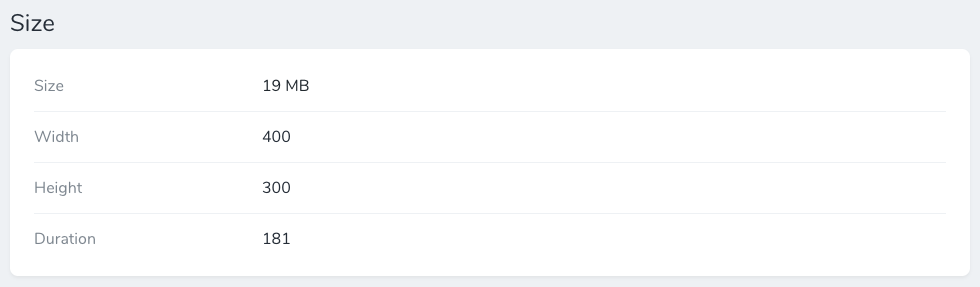

# Nova File Size Field

Outputs a field containing bytes to a human readable format:

12000 => **12 KB**  
25000000 => **25 MB**  
99000000000 => **99 GB**  



## Installation

You can install the package in to a Laravel app that uses Nova via composer:
```bash
composer require itiden/nova-file-size-field
```

## Usage
```php
use Itiden\Fields\FileSize;

FileSize::make('Field name'),
```
The field extends the base Laravel\Nova\Fields\Field, so all the usual methods are available.

## License
The MIT License (MIT). Please see [License File](LICENSE) for more information.


